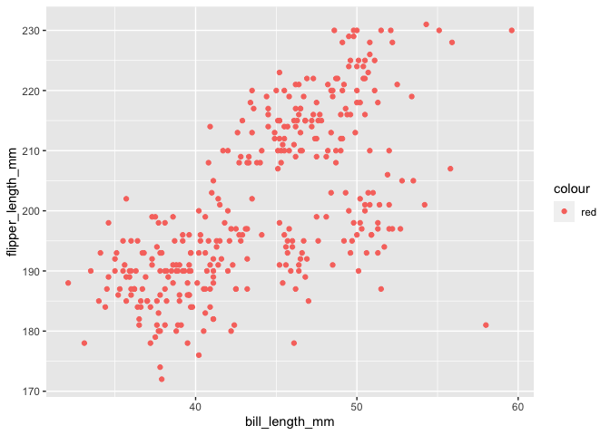

p8105\_hw1\_if2282
================
Ifrah Fayyaz

-   [Problem 1](#problem-1)
    -   [Creating a random sample of size 10, character variable and
        factor.](#creating-a-random-sample-of-size-10-character-variable-and-factor)
    -   [Taking means for logical, character and factor
        variables:](#taking-means-for-logical-character-and-factor-variables)
-   [Problem 2](#problem-2)
    -   [Penguin Data Description](#penguin-data-description)
    -   [Scatterplot for Bill Length vs. Flipper
        Length](#scatterplot-for-bill-length-vs-flipper-length)

# Problem 1

## Creating a random sample of size 10, character variable and factor.

``` r
prob1_df = 
  tibble(
    samp = rnorm(10),
    gr_than_0 = samp > 0,
    char = c("Apple", "2020", "4", "Fish", "8", "Pigeon", "1999", "Rain", "987", "gr8"),
    fact = factor(c("First", "Second", "Third", "Second", "First", "First", "Third", "First", "Second", "Second"))
  )
mean(pull(prob1_df, samp))
```

    ## [1] -0.1733651

``` r
mean(pull(prob1_df, gr_than_0))
```

    ## [1] 0.3

``` r
mean(pull(prob1_df, char))
```

    ## [1] NA

``` r
mean(pull(prob1_df, fact))
```

    ## [1] NA

Only the mean for “samp” variable works since it is a numeric variable.
The mean for the logical, character and factor variables is not
generated and I am given a warning message.

## Taking means for logical, character and factor variables:

``` r
gr_than_0.n = mean(as.numeric(pull(prob1_df, gr_than_0)))
char.n = mean(as.numeric(pull(prob1_df, char)))
fact.n = mean(as.numeric(pull(prob1_df, fact)))
```

After applying as.numeric, we obtained mean for all the variables. I got
a numeric mean for my factor variable and that is because my elements
got converted to numbers - “first” got converted to 1 etc. For the
character variable, I got the mean as ‘NA\_real\_’ and that is because
even after converting its type to numeric, the elements were not
numeric.

# Problem 2

## Penguin Data Description

The penguin dataset has the following variables: species, island,
bill\_length\_mm, bill\_depth\_mm, flipper\_length\_mm, body\_mass\_g,
sex, year. The total number of rows in the dataset are 344 and the
number of columns are 8. The mean flipper length is 200.9152047mm.

## Scatterplot for Bill Length vs. Flipper Length

``` r
ggplot(penguins, aes(x = bill_length_mm, y = flipper_length_mm, color = 'red')) + geom_point()
```

<!-- -->

``` r
ggsave("scatterplot.pdf", height = 8, width = 12)
```
